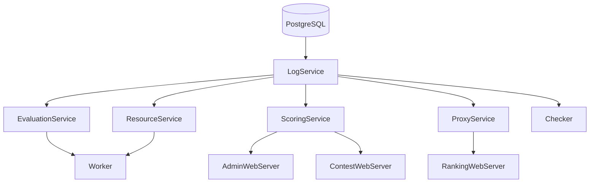

# CMS Docker - Repository Architecture

> **Last Updated:** 2025-12-22
> **Maintainer:** CCYod (champyodsakon@gmail.com)

## Overview

This repository provides a Docker-based deployment for [Contest Management System (CMS)](https://github.com/cms-dev/cms), an IOI-style programming contest grader. It wraps the official CMS in Docker containers for easy deployment and scaling.

---

## Directory Structure

```
cms-docker/
├── .agent/                    # Agent documentation (this directory)
│   ├── ARCHITECTURE.md        # This file - repo structure & methods
│   └── CHANGELOG.md           # Change log of modifications
│
├── .github/                   # GitHub configurations
│   ├── workflows/
│   │   └── docker-build.yml   # CI/CD: Build & integration tests
│   ├── ISSUE_TEMPLATE/        # Issue templates
│   └── dependabot.yml         # Dependency updates
│
├── src/                       # Git submodule → github.com/cms-dev/cms
│   ├── install.py             # CMS installer script
│   ├── pyproject.toml         # Python package definition
│   ├── constraints.txt        # Pinned dependencies
│   ├── config/                # Sample config files
│   │   ├── cms.sample.toml    # Main CMS config template
│   │   └── cms.ranking.sample.toml
│   ├── cms/                   # CMS Python package source
│   ├── cmsranking/            # Ranking server (custom static files)
│   └── ...                    # Other CMS source code
│
├── config/                    # Generated configs (created by `make env`)
│   ├── cms.toml               # Active CMS config (gitignored)
│   └── cms.ranking.toml       # Active ranking config (gitignored)
│
├── docker/                    # Development/testing compose files
│   ├── docker-compose.dev.yml
│   └── docker-compose.test.yml
│
├── .env.*                     # Environment configurations
│   ├── .env.core.example      # Core services template
│   ├── .env.admin.example     # Admin services template
│   ├── .env.contest.example   # Contest services template
│   └── .env.worker.example    # Worker services template
│
├── docker-compose.*.yml       # Production compose files
│   ├── docker-compose.core.yml    # Database + core services
│   ├── docker-compose.admin.yml   # Admin + Ranking web
│   ├── docker-compose.contest.yml # Contest web server
│   └── docker-compose.worker.yml  # Evaluation workers
│
├── Dockerfile                 # Main Docker image definition
├── Makefile                   # Deployment automation
└── README.md                  # User documentation
```

---

## Architecture

### Container Services

| Stack | Container | Service | Port |
|-------|-----------|---------|------|
| **Core** | cms-database | PostgreSQL 15 | 5432 (internal) |
| | cms-log-service | LogService | 29000 |
| | cms-resource-service | ResourceService | 28000, 28001 |
| | cms-scoring-service | ScoringService | 28500 |
| | cms-evaluation-service | EvaluationService | 25000 |
| | cms-proxy-service | ProxyService | 28600 |
| | cms-checker-service | Checker | 22000 |
| **Admin** | cms-admin-web-server | AdminWebServer | **8889** |
| | cms-ranking-web-server | RankingWebServer | **8890** |
| **Contest** | cms-contest-web-server-{id} | ContestWebServer | **8888** |
| **Worker** | cms-worker-{shard} | Worker | 26000+ |

### Service Dependencies



---

## Deployment Methods

### Local Development

```bash
git clone https://github.com/champyod/cms-docker.git
cd cms-docker
git submodule update --init --recursive

# Configure
cp .env.core.example .env.core  # Edit with your settings
make env                        # Generate .env and config/cms.toml

# Deploy
make core                       # Start core services
docker exec -it cms-log-service cmsInitDB        # Initialize DB
docker exec -it cms-log-service cmsAddAdmin admin -p Password123!
make admin                      # Start admin interface
make contest                    # Start contest interface
make worker                     # Start workers
```

### Remote Worker Setup (Tailscale)

1. On VPS: Set `TAILSCALE_IP` in `.env.core`
2. On Worker: Set `CORE_SERVICES_IP` in `.env.worker`
3. Edit `config/cms.toml` Worker list with worker's Tailscale IP

---

## Environment Configuration

### .env.core (Required)
| Variable | Description | Default |
|----------|-------------|---------|
| `POSTGRES_DB` | Database name | cmsdb |
| `POSTGRES_USER` | Database user | cmsuser |
| `POSTGRES_PASSWORD` | Database password | **Required** |
| `TAILSCALE_IP` | VPN IP for remote workers | (empty) |

### .env.admin
| Variable | Description | Default |
|----------|-------------|---------|
| `ADMIN_PORT_EXTERNAL` | Admin web port | 8889 |
| `RANKING_PORT_EXTERNAL` | Ranking port | 8890 |

### .env.contest
| Variable | Description | Default |
|----------|-------------|---------|
| `CONTEST_ID` | Contest to serve | 1 |
| `CONTEST_PORT_EXTERNAL` | Contest web port | 8888 |

### .env.worker
| Variable | Description | Default |
|----------|-------------|---------|
| `WORKER_SHARD` | Worker instance number | 0 |
| `CORE_SERVICES_IP` | VPS IP (for remote workers) | (empty) |

---

## Build Process (Dockerfile)

1. **Base**: Ubuntu Noble / Debian Bookworm
2. **System packages**: Compilers (C++, Java, Pascal, Python, Rust, etc.)
3. **Isolate sandbox**: From APT or built from source (arm64)
4. **CMS user**: `cmsuser` (uid 1001) with sudo + isolate group
5. **Python venv**: Created at `/home/cmsuser/cms/`
6. **CMS install**: `./install.py cms --devel` from `src/` submodule

### Key Paths Inside Container
- `/home/cmsuser/cms-docker/` - Repository root
- `/home/cmsuser/cms-docker/src/` - CMS submodule
- `/home/cmsuser/cms/` - Python venv + installed CMS
- `/usr/local/etc/cms.toml` - CMS config (mounted from `./config/`)

---

## CI/CD (GitHub Actions)

### docker-build.yml

**Triggers:** Push to any branch, PRs, version tags

**Jobs:**
1. **build** - Multi-arch build (amd64 + arm64)
   - Builds Docker image
   - Verifies CMS import

2. **integration-test** - Full service testing
   - Starts all services in order
   - Initializes database
   - Creates test admin
   - Verifies web servers respond
   - Collects logs for debugging

---

## Notes

- The `src/` directory is a **git submodule** of the official CMS repo
- Config files in `config/` are generated by `make env` and gitignored
- Workers require **privileged mode** and cgroup access for sandboxing
- Remote workers connect via Tailscale VPN for security
