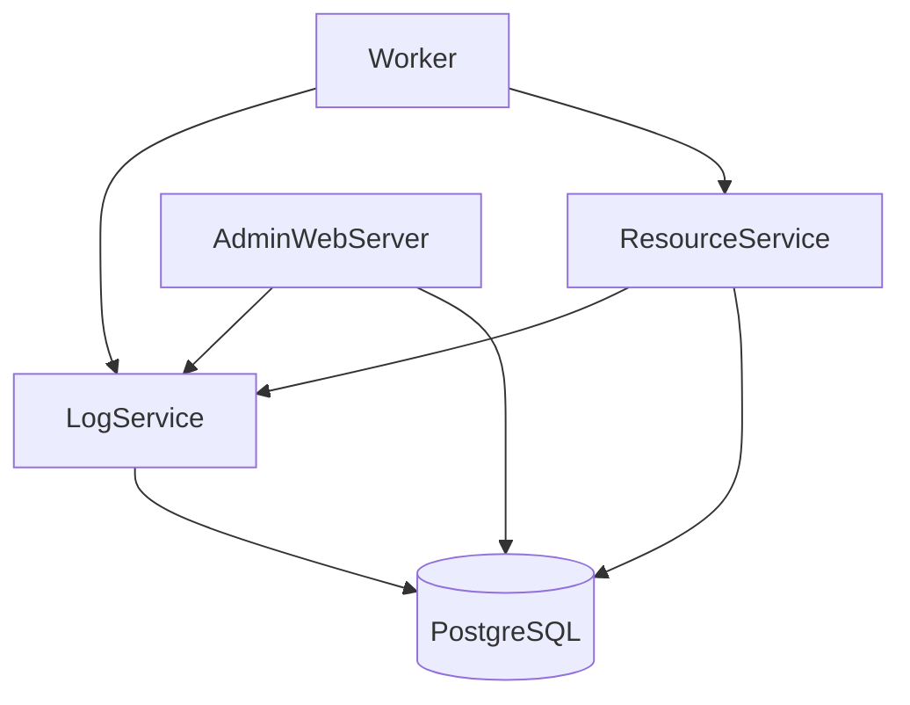

# CMS Docker - Contest Management System in Docker

This repository provides a Dockerized environment for the [Contest Management System (CMS)](https://github.com/cms-dev/cms). It supports both **Image-based** (recommended for users) and **Source-based** (for developers) deployments.

## 1. Environment Variables

Before starting, generate the configuration file:

```bash
make env
```

This merges `.env.core`, `.env.admin`, etc. into a single `.env` file.

| File | Purpose | Key Variables |
| :--- | :--- | :--- |
| `.env.core` | Core service settings | `POSTGRES_PASSWORD`: Database password<br>`APT_MIRROR`: Mirror for builds (Source mode) |
| `.env.admin` | Admin panel settings | `ADMIN_DOMAIN`: Domain for admin panel<br>`ADMIN_LISTEN_PORT`: Port (default 8889) |
| `.env.worker` | Worker settings | `CORE_SERVICES_HOST`: Hostname/IP of core services (for remote workers)<br>`WORKER_SHARD`: Unique ID for each worker |

**Workflow for Config Changes:**
1. Edit `.env.core` (or other partial files).
2. Run `make env` to regenerate `.env`.
3. Restart services (e.g., `make core-img` or `docker compose restart`).

## 2. Deployment Options

### Option 1: Image Based (Recommended)
Uses pre-built images from GitHub Container Registry. Faster and more stable.

```bash
# 1. Generate config
make env

# 2. Pull latest images
make pull

# 3. Start Core Services (Database, LogService, ResourceService, etc.)
make core-img

# 4. Initialize Database (First run only)
make cms-init

# 5. Create Admin User
make create-admin

# 6. Start Admin Panel
make admin-img

# 7. Start Worker
make worker-img
```

### Option 2: Source Based (Development)
Builds images locally from the `Dockerfile`. Useful if you are modifying CMS code.

```bash
make env
make core    # Builds and starts core services
make admin   # Builds and starts admin services
make worker  # Builds and starts worker
```

## 3. Remote Worker Deployment

To run a worker on a different machine (e.g., a Raspberry Pi or separate VPS):

1.  **On Core Machine:** Ensure `TAILSCALE_IP` or public IP is set in `.env` and ports (29000, 28000, etc.) are exposed.
2.  **On Worker Machine:**
    *   Clone this repo.
    *   Edit `.env.worker`:
        *   Set `CORE_SERVICES_HOST=Your_Core_Machine_IP`.
        *   Set `WORKER_SHARD=1` (unique per worker).
    *   Run:
        ```bash
        make env
        make worker-img
        ```

## 4. Service Structure

The system is modular. Ensure dependencies are met:



*   **Core Stack (`core-img`)**: Database + LogService + ResourceService + Scoring + Evaluation + Proxy + Checker.
*   **Admin Stack (`admin-img`)**: AdminWebServer + RankingWebServer.
*   **Worker Stack (`worker-img`)**: Worker service (execution sandbox).

## Key Commands

| Command | Description |
| :--- | :--- |
| `make env` | Generate `.env` file |
| `make pull` | Update images |
| `make cores-img` | Start Core services (Prod) |
| `make cms-init` | Initialize DB schema |
| `make create-admin` | Create admin user |
| `make up` | Start EVERYTHING (Image mode) |
| `make down` | Stop all services |
