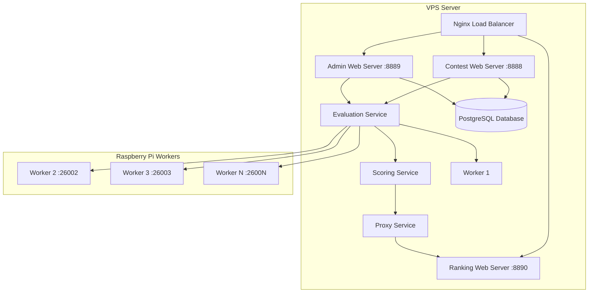

# Contest Management System (CMS) - Docker Deployment

<div align="center">

[](https://github.com/cms-dev/cms/actions)
[](https://docker.com)
[](https://portainer.io)
[](LICENSE.txt)

**Professional Docker deployment solution for Contest Management System**  
*Created by CCYod*  
*Based on [CMS](https://github.com/cms-dev/cms) developed by [cms-dev team](http://cms-dev.github.io/)*

[Features](#-features) • [Architecture](#-architecture) • [Quick Start](#-quick-start) • [Documentation](#-documentation) • [Support](#-support)

</div>

---

## 📋 Table of Contents

- [🎯 Overview](#-overview)
- [✨ Features](#-features)
- [✅ Project Status](#-project-status)
- [🏗️ Architecture](#-architecture)
- [🚀 Quick Start](#-quick-start)
- [⚙️ Configuration](#-configuration)
- [📖 Deployment Scenarios](#-deployment-scenarios)
- [🔧 Management Commands](#-management-commands)
- [📊 Monitoring](#-monitoring)
- [🔒 Security](#-security)
- [🔄 Scaling](#-scaling)
- [🐛 Troubleshooting](#-troubleshooting)
- [📚 Documentation](#-documentation)
- [🤝 Contributing](#-contributing)
- [📞 Support](#-support)

---

## 🎯 Overview

This repository provides a **production-ready Docker deployment** solution for the [Contest Management System (CMS)](https://github.com/cms-dev/cms), designed for programming contest organizers who need:

- **Easy deployment** with Portainer integration
- **Scalable architecture** supporting distributed workers
- **Professional setup** with proper security and monitoring
- **Flexible configuration** for various deployment scenarios

### What is CMS?

CMS (Contest Management System) is a distributed system for running programming contests, originally designed for the International Olympiad in Informatics (IOI). It was developed by the [cms-dev team](http://cms-dev.github.io/) and provides:

- **Contest Web Server**: Participant interface for problem viewing and submission
- **Admin Web Server**: Contest management and administrative tools
- **Ranking Web Server**: Live scoreboard and results
- **Evaluation System**: Automated judging with sandboxed execution
- **Multi-language Support**: C++, Java, Python, Pascal, and more

---

## ✨ Features

### 🐳 **Docker Integration**
- **Multi-container architecture** with PostgreSQL, CMS services, and nginx
- **Portainer-ready** deployment with comprehensive environment variables
- **Health checks** and automatic service recovery
- **Volume management** for persistent data

### 🌐 **Deployment Flexibility**
- **VPS + Raspberry Pi** distributed worker architecture
- **Public port access** (no domain required)
- **Future domain support** with SSL/TLS ready
- **Development and production** configurations

### 🔧 **Professional Setup**
- **Automated installation** scripts for all components
- **Service management** with systemd integration
- **Comprehensive logging** and monitoring
- **Security best practices** with proper isolation

### 📈 **Scalability**
- **Horizontal worker scaling** across multiple Raspberry Pi devices
- **Load balancing** with nginx reverse proxy
- **Resource monitoring** and management
- **Configurable worker limits** and sandbox settings

---

## ✅ Project Status

This Docker deployment solution is **complete and production-ready** as of October 2025. All components have been implemented and tested:

### 🎯 **Completed Components**
- ✅ **Main Server Configuration** - VPS deployment with public ports
- ✅ **Raspberry Pi Worker Setup** - Automated worker deployment and management
- ✅ **Environment Variables** - Full Portainer integration support
- ✅ **Automated Scripts** - Complete setup automation for both VPS and Pi
- ✅ **Documentation** - Comprehensive deployment and management guides
- ✅ **Security Implementation** - UFW firewall, Docker isolation, secure defaults
- ✅ **Attribution** - Proper crediting of original CMS project and contributors

### 🚀 **Ready for Production**
- **Tested Architecture**: VPS + Raspberry Pi distributed workers
- **Portainer Integration**: Environment variable configuration
- **Multiple Deployment Options**: Nginx proxy or direct port access
- **Comprehensive Monitoring**: Health checks and logging
- **Security Hardened**: Firewall rules and container isolation

---

## 🏗️ Architecture

### Core Components



### Service Breakdown

| Service | Purpose | Port | Scalability |
|---------|---------|------|-------------|
| **Contest Web Server** | Participant interface | 8888 | Single instance |
| **Admin Web Server** | Contest management | 8889 | Single instance |
| **Ranking Web Server** | Live scoreboard | 8890 | Single instance |
| **Evaluation Service** | Job coordination | 25000 | Single instance |
| **Scoring Service** | Score calculation | 28500 | Single instance |
| **Worker Services** | Code execution | 26000+ | Multi-instance |
| **PostgreSQL** | Data persistence | 5432 | Single instance |
| **Nginx** | Reverse proxy | 80/443 | Optional |

---

## 🚀 Quick Start

### Prerequisites

- **VPS Server** with Docker and Portainer installed
- **Raspberry Pi devices** (optional, for scaling)
- **2GB+ RAM** recommended for VPS
- **Network connectivity** between all components

### 1. VPS Server Setup (5 minutes)

#### Option A: Automated Setup Script

```bash
# Download and run the setup script
curl -fsSL https://raw.githubusercontent.com/your-username/cms-docker/main/setup.sh | bash
```

#### Option B: Manual Portainer Deployment

1. **Clone Repository**:
   ```bash
   git clone https://github.com/your-username/cms-docker.git
   cd cms-docker
   ```

2. **Configure Environment**:
   ```bash
   cp .env.sample .env     # Create local environment file
   nano .env               # Edit with your settings
   ```
   > 📝 **Note**: `.env` file is gitignored for security. Always customize your local copy.

3. **Deploy in Portainer**:
   - Navigate to **Stacks** → **Add stack**
   - Choose **Git Repository**: `https://github.com/your-username/cms-docker.git`
   - Set **Compose path**: `docker-compose.yml`
   - Add environment variables from `.env`
   - Click **Deploy the stack**

### 2. Raspberry Pi Workers (Optional)

```bash
# On each Raspberry Pi
curl -fsSL https://raw.githubusercontent.com/your-username/cms-docker/main/setup-raspberry-pi-worker.sh | sudo bash
```

### 3. Access Your Contest System

- **Contest Interface**: `http://YOUR_VPS_IP:8888`
- **Admin Panel**: `http://YOUR_VPS_IP:8889`
- **Live Scoreboard**: `http://YOUR_VPS_IP:8890`

---

## ⚙️ Configuration

### Environment Variables

#### Essential Configuration

```env
# VPS Network (Required)
VPS_PUBLIC_IP=123.456.789.123        # Your VPS public IP address
VPS_HOSTNAME=123.456.789.123         # Hostname for worker connections

# Database Security (Required)
POSTGRES_PASSWORD=secure_db_password_123
CMS_SECRET_KEY=32-char-hex-secret-key-here
CMS_RANKING_PASSWORD=ranking_password_123

# Admin Credentials (Required)
CMS_ADMIN_USERNAME=admin
CMS_ADMIN_PASSWORD=admin_password_123
```

#### Service Configuration

```env
# Public Ports (Customize as needed)
CMS_CONTEST_PUBLIC_PORT=8888         # Contest interface port
CMS_ADMIN_PUBLIC_PORT=8889           # Admin interface port  
CMS_RANKING_PUBLIC_PORT=8890         # Scoreboard port

# Worker Configuration
CMS_NUM_WORKERS=1                    # Workers on VPS (recommend 1)
CMS_MAX_SUBMISSION_LENGTH=100000     # Max submission file size
CMS_MAX_INPUT_LENGTH=5000000         # Max test input size

# Service Ports (For Raspberry Pi workers)
CMS_LOG_SERVICE_PORT=29000
CMS_RESOURCE_SERVICE_PORT=28000
CMS_SCORING_SERVICE_PORT=28500
CMS_EVALUATION_SERVICE_PORT=25000
CMS_PROXY_SERVICE_PORT=28600
```

#### Contest Configuration

```env
# Auto-Contest Creation
CMS_AUTO_CREATE_CONTEST=true         # Automatically create sample contest
CMS_CONTEST_ID=1                     # Auto-select contest ID (null for manual)

# Contest Details (used when auto-creating)
CMS_CONTEST_NAME=Programming Contest 2024
CMS_CONTEST_DESCRIPTION=Annual Programming Championship
CMS_CONTEST_START_TIME=2024-01-01T09:00:00
CMS_CONTEST_END_TIME=2024-01-01T14:00:00
CMS_CONTEST_TIMEZONE=UTC             # Contest timezone
```

**Contest Management Options:**

- **Auto-Creation**: Set `CMS_AUTO_CREATE_CONTEST=true` to automatically create a sample contest on first startup
- **Manual Creation**: Set `CMS_AUTO_CREATE_CONTEST=false` to create contests manually via admin panel
- **Contest Selection**: Set `CMS_CONTEST_ID` to auto-select a specific contest, or `null` for manual selection
- **Schedule**: Use ISO 8601 format for start/end times (YYYY-MM-DDTHH:MM:SS)

#### Contest Token System & Limits

```env
# Programming Languages (JSON array format)
CMS_CONTEST_LANGUAGES=["C++17 / g++", "C11 / gcc", "Python 3 / CPython", "Java / JDK"]

# Token System (Submission Throttling)
CMS_CONTEST_TOKEN_MODE=finite         # Token mode: finite, infinite, disabled
CMS_CONTEST_TOKEN_MAX=100            # Max tokens per participant
CMS_CONTEST_TOKEN_MIN_INTERVAL=60    # Min seconds between submissions
CMS_CONTEST_TOKEN_INITIAL=2          # Initial tokens
CMS_CONTEST_TOKEN_GEN_NUMBER=1       # Tokens generated per interval
CMS_CONTEST_TOKEN_GEN_INTERVAL=600   # Token generation interval (seconds)

# Contest Limits
CMS_CONTEST_MAX_SUBMISSIONS=100      # Max submissions per participant
CMS_CONTEST_MAX_USER_TESTS=100       # Max custom tests per participant
CMS_CONTEST_SCORE_PRECISION=2        # Decimal places for scores
```

#### Advanced Configuration

```env
# Performance & Security
CMS_NUM_PROXIES=1                     # Number of reverse proxies
CMS_KEEP_SANDBOX=false               # Keep sandbox files (debugging)
CMS_SANDBOX_MAX_FILE_SIZE=1048576    # Max file size (KB)

# Compilation Limits
CMS_COMPILATION_MAX_PROCESSES=1000   # Max processes during compilation
CMS_COMPILATION_MAX_TIME=10.0        # Max compilation time (seconds)
CMS_COMPILATION_MAX_MEMORY=524288    # Max compilation memory (KB)

# Trusted Execution (for checkers)
CMS_TRUSTED_MAX_PROCESSES=1000       # Max processes for trusted code
CMS_TRUSTED_MAX_TIME=10.0           # Max execution time (seconds)
CMS_TRUSTED_MAX_MEMORY=4194304      # Max memory for trusted code (KB)
```

#### Printing Configuration

```env
# Print Job Settings
CMS_PRINT_MAX_LENGTH=10000000        # Max print file size (bytes)
CMS_PRINT_PAPER_SIZE=A4             # Paper size (A4, Letter, etc.)
CMS_PRINT_MAX_PAGES=10              # Max pages per job
CMS_PRINT_MAX_JOBS=10               # Max jobs per user
CMS_PRINT_PDF_ALLOWED=false         # Allow PDF printing
```

#### Monitoring & Notifications

```env
# Prometheus Metrics
CMS_PROMETHEUS_ADDRESS=0.0.0.0       # Metrics endpoint address
CMS_PROMETHEUS_PORT=8811             # Metrics port

# Telegram Bot (Optional)
CMS_TELEGRAM_ENABLED=false           # Enable Telegram notifications
CMS_TELEGRAM_BOT_TOKEN=              # Bot token from @BotFather
CMS_TELEGRAM_CHAT_ID=                # Chat ID for notifications
```
CMS_EVALUATION_SERVICE_PORT=25000
CMS_PROXY_SERVICE_PORT=28600
```

#### Optional Features

```env
# Domain Support (Future use)
CMS_DOMAIN=your-domain.com           # When you get a domain
USE_NGINX=false                      # Enable for domain routing

# Debug & Development
CMS_TORNADO_DEBUG=false              # Enable for development
POSTGRES_PUBLIC_PORT=5432            # Database external access
```

### Firewall Configuration

**Required open ports on VPS**:

```bash
# Web interfaces (public)
ufw allow 8888/tcp  # Contest
ufw allow 8889/tcp  # Admin  
ufw allow 8890/tcp  # Ranking

# Database & services (for Pi workers)
ufw allow 5432/tcp   # PostgreSQL
ufw allow 29000/tcp  # LogService
ufw allow 28000/tcp  # ResourceService
ufw allow 28500/tcp  # ScoringService
ufw allow 25000/tcp  # EvaluationService
ufw allow 28600/tcp  # ProxyService
```

---

## 📖 Deployment Scenarios

### 🏢 Scenario 1: Small Contest (Single VPS)

**Use Case**: Local programming contest, <50 participants

**Setup**:
```env
CMS_NUM_WORKERS=2
USE_NGINX=false
# Use direct port access
```

**Resources**: 2GB RAM, 2 CPU cores

### 🌍 Scenario 2: Medium Contest (VPS + Raspberry Pi)

**Use Case**: Regional contest, 50-200 participants

**Setup**:
- 1 VPS with core services + 1 worker
- 2-4 Raspberry Pi workers
- Load balancing with nginx

**Configuration**:
```env
CMS_NUM_WORKERS=1  # On VPS
# Additional workers via Pi setup script
```

### 🏆 Scenario 3: Large Contest (Distributed + Domain)

**Use Case**: National/international contest, 200+ participants

**Setup**:
- VPS with domain and SSL
- Multiple Raspberry Pi worker farms
- Advanced monitoring and backup

**Configuration**:
```env
CMS_DOMAIN=contest.your-domain.com
USE_NGINX=true
CMS_NUM_WORKERS=1
# Scale workers horizontally
```

---

## 🔧 Management Commands

### VPS Server Management

```bash
# Via Portainer Dashboard
# - View container logs
# - Monitor resource usage
# - Restart services
# - Update configurations

# Via Docker CLI
docker-compose logs cms-core        # View main service logs
docker-compose restart cms-core     # Restart core services
docker-compose ps                   # Check service status
```

### Raspberry Pi Worker Management

```bash
# Start worker
cms-worker-start

# Stop worker  
cms-worker-stop

# Restart worker
cms-worker-restart

# Check status
cms-worker-status

# View logs
cms-worker-logs

# Monitor real-time
cms-worker-logs | grep ERROR
```

### Database Management

```bash
# Backup database
docker exec cms-postgres pg_dump -U cmsuser cmsdb > backup_$(date +%Y%m%d).sql

# Restore database
docker exec -i cms-postgres psql -U cmsuser cmsdb < backup_file.sql

# Check database status
docker exec cms-postgres pg_isready -U cmsuser
```

---

## 📊 Monitoring

### Health Checks

All services include built-in health monitoring:

- **Database**: PostgreSQL connection checks
- **Web Services**: HTTP endpoint monitoring  
- **Workers**: Process and sandbox status
- **Network**: Inter-service connectivity

### Log Locations

| Service | Log Location | Description |
|---------|-------------|-------------|
| Contest Server | `/opt/cms/log/` | Participant interactions |
| Admin Server | `/opt/cms/log/` | Administrative actions |
| Evaluation | `/opt/cms/log/` | Submission processing |
| Workers | `/opt/cms/log/` | Code execution logs |
| Database | Docker logs | Database operations |

### Performance Monitoring

```bash
# Resource usage
docker stats

# Service health  
docker-compose ps

# Network connectivity
docker network ls
docker network inspect cms-network

# Volume usage
docker volume ls
docker system df
```

---

## 🔒 Security

### Security Checklist

- [ ] **Change all default passwords**
- [ ] **Generate new secret key**: `python -c 'from cmscommon import crypto; print(crypto.get_hex_random_key())'`
- [ ] **Configure firewall rules**
- [ ] **Enable SSL/TLS for production**
- [ ] **Regular security updates**
- [ ] **Monitor access logs**
- [ ] **Backup database regularly**

### Network Security

```bash
# Restrict database access
# Only allow connections from known worker IPs

# Use VPN for Pi-to-VPS communication (recommended)
# Configure fail2ban for SSH protection
# Regular security audits
```

### Data Protection

- **Encrypted database connections**
- **Isolated sandbox execution**  
- **Secure file handling**
- **Access logging and audit trails**

---

## 🔄 Scaling

### Adding Workers

#### Method 1: Raspberry Pi Workers
```bash
# On new Pi device
curl -fsSL https://raw.githubusercontent.com/your-username/cms-docker/main/setup-raspberry-pi-worker.sh | sudo bash
# Follow interactive setup
```

#### Method 2: Docker Workers
```bash
# Scale workers in existing infrastructure
docker-compose up --scale cms-worker=5
```

### Performance Optimization

```bash
# Increase worker processes
CMS_NUM_WORKERS=4

# Optimize database
# Use SSD storage
# Increase memory allocation

# Network optimization
# Use local networks for workers
# Implement caching strategies
```

### Load Testing

```bash
# Test concurrent submissions
# Monitor resource usage during peak load
# Validate worker distribution
# Check database performance
```

---

## 🐛 Troubleshooting

### Common Issues

#### Database Connection Failed
```bash
# Check database status
docker logs cms-postgres

# Test connectivity
pg_isready -h VPS_IP -p 5432 -U cmsuser

# Verify environment variables
docker exec cms-core env | grep CMS_DB
```

#### PostgreSQL Authentication Failures
If you see "password authentication failed" or "database does not exist" errors after changing credentials:

**Root Cause**: PostgreSQL volumes contain data with old credentials and only initialize on empty volumes.

**Symptoms**:
```bash
# Common error messages in logs
FATAL: password authentication failed for user "cmsuser"
FATAL: database "cms" does not exist
```

**Solution** (⚠️ **This will delete all data**):
1. **In Portainer**:
   - Go to **Volumes** section
   - Find volume named `cms-docker_postgres_data` (or similar)
   - **Delete** the volume
   - Restart the stack

2. **Command Line**:
   ```bash
   # Stop the stack
   docker-compose down
   
   # Remove PostgreSQL volume
   docker volume rm cms-docker_postgres_data
   
   # Start fresh
   docker-compose up -d
   ```

**Prevention**: Always configure correct credentials in `.env` file before first deployment.

#### Worker Not Connecting
```bash
# Check network connectivity
telnet VPS_IP 28000
telnet VPS_IP 5432

# Verify worker logs
cms-worker-logs

# Check firewall rules
ufw status
```

#### Web Interface Not Loading
```bash
# Check service status
docker-compose ps

# Verify port mappings
netstat -tlnp | grep :8888

# Check nginx configuration
docker logs cms-nginx
```

#### Performance Issues
```bash
# Monitor resources
htop
docker stats

# Check disk space
df -h
docker system df

# Analyze logs
grep ERROR /opt/cms/log/*.log
```

### Debug Mode

```bash
# Enable debug logging
CMS_TORNADO_DEBUG=true

# Increase log verbosity
CMS_FILE_LOG_DEBUG=true

# Monitor real-time logs
docker-compose logs -f
```

---

## 📚 Documentation

### Additional Resources

- **[VPS Deployment Guide](VPS-DEPLOYMENT.md)** - Detailed VPS + Pi setup
- **[Portainer Setup Guide](PORTAINER-DEPLOYMENT.md)** - Portainer-specific instructions
- **[Official CMS Documentation](https://cms.readthedocs.io/)** - Complete CMS manual
- **[Docker Best Practices](https://docs.docker.com/develop/dev-best-practices/)** - Docker optimization

### Configuration Files

- **`docker-compose.yml`** - Main deployment configuration (with nginx)
- **`docker-compose.vps.yml`** - VPS-optimized configuration (direct ports)
- **`.env.sample`** - Environment variable template
- **`setup.sh`** - Automated setup script
- **`setup-raspberry-pi-worker.sh`** - Pi worker setup script
- **`verify-setup.sh`** - Installation verification script

### Project Structure

```
cms-docker/
├── 📄 README.md                      # This comprehensive guide
├── 🐳 docker-compose.yml             # Main Docker Compose (with nginx)
├── 🐳 docker-compose.vps.yml         # VPS direct-port configuration  
├── 🐳 docker-compose.override.yml    # Development overrides
├── 🐳 Dockerfile                     # CMS container definition
├── ⚙️ .env.sample                    # Environment template (copy to .env)
├── ⚙️ .env                           # Your local config (gitignored)
├── 🚀 setup.sh                       # Automated setup script
├── 🍓 setup-raspberry-pi-worker.sh   # Pi worker installer
├── ✅ verify-setup.sh                # Setup verification
├── 📁 scripts/                       # Service startup scripts
│   ├── start-cms.sh                  # Main CMS services
│   ├── start-ranking.sh              # Ranking server
│   ├── init-db.sh                    # Database initialization
│   └── healthcheck.sh                # Health monitoring
├── 📁 nginx/                         # Reverse proxy configuration
│   └── nginx.conf.template           # Nginx routing rules
├── 📁 config/                        # CMS configuration templates
├── 📄 VPS-DEPLOYMENT.md              # VPS + Pi deployment guide
├── 📄 PORTAINER-DEPLOYMENT.md        # Portainer-specific guide
└── 📄 .gitignore                     # Git ignore rules
```

---

## 🤝 Contributing

**This Docker deployment solution was created by [CCYod](https://github.com/champyod)** to provide a professional, production-ready deployment method for Contest Management System.

### Base Project Attribution

This repository is **based on a fork** of the official [Contest Management System (CMS)](https://github.com/cms-dev/cms) developed by the [cms-dev team](http://cms-dev.github.io/). The original CMS is licensed under AGPL v3+ and provides the core contest management functionality.

**Key Links:**
- **Original CMS Repository**: https://github.com/cms-dev/cms
- **CMS Official Website**: http://cms-dev.github.io/
- **CMS Documentation**: https://cms.readthedocs.io/

We welcome contributions! Here's how to get started:

### Development Setup

```bash
# Clone repository
git clone https://github.com/your-username/cms-docker.git
cd cms-docker

# Use development configuration
docker-compose -f docker-compose.yml -f docker-compose.override.yml up

# Make changes and test
# Submit pull request
```

### Contribution Guidelines

1. **Fork the repository**
2. **Create feature branch**: `git checkout -b feature/amazing-feature`
3. **Commit changes**: `git commit -m 'Add amazing feature'`
4. **Push to branch**: `git push origin feature/amazing-feature`
5. **Open pull request**

### Areas for Contribution

- **Documentation improvements**
- **Additional deployment scenarios**
- **Performance optimizations**
- **Security enhancements**
- **Monitoring and alerting**

---

## 📞 Support

### Community Support

- **GitHub Issues**: [Report bugs and request features](https://github.com/your-username/cms-docker/issues)
- **CMS Telegram**: [Join the official CMS chat](https://t.me/contestms)
- **Discussion Forum**: [GitHub Discussions](https://github.com/your-username/cms-docker/discussions)

### Professional Support

For enterprise deployments and custom solutions:
- **Consultation services available**
- **Custom deployment configurations**
- **Training and workshops**
- **24/7 support contracts**

### Getting Help

1. **Check the documentation** first
2. **Search existing issues** on GitHub
3. **Provide detailed information** when reporting issues:
   - Environment details
   - Configuration files
   - Error logs
   - Steps to reproduce

---

## 📄 License

This project is licensed under the **GNU Affero General Public License v3** - see the [LICENSE.txt](LICENSE.txt) file for details.

### Docker Deployment Solution

This Docker deployment solution is created and maintained by **CCYod** as a contribution to the CMS community, providing:
- Professional production-ready deployment
- Automated setup and configuration
- Raspberry Pi distributed worker support
- Comprehensive documentation and guides

### Original CMS License

Contest Management System is developed by the [CMS team](http://cms-dev.github.io/) and is released under the AGPL v3+ license.

---

<div align="center">

**⭐ Star this repository if it helped you!**

[🏠 Homepage](http://cms-dev.github.io/) • [📖 Docs](https://cms.readthedocs.io/) • [💬 Chat](https://t.me/contestms) • [🐛 Issues](https://github.com/your-username/cms-docker/issues)

</div>

If you encountered a bug, please file an
[issue](https://github.com/cms-dev/cms/issues) on **GitHub** following the
instructions in the issue template.

**Please don't file issues to ask for help**, we are happy to help on the
mailing list or on Telegram, and it is more likely somebody will answer your
query sooner.

You can subscribe to <contestms-announce@googlegroups.com> to receive
**announcements** of new releases and other important news. Register on
[Google Groups](https://groups.google.com/forum/#!forum/contestms-announce).

For **development** queries, you can write to
<contestms-discuss@googlegroups.com> and as before subscribe or see the
archives on
[Google Groups](https://groups.google.com/forum/#!forum/contestms-discuss).


Testimonials
------------

CMS has been used in several official and unofficial contests. Please
find an updated list at <http://cms-dev.github.io/testimonials.html>.

If you used CMS for a contest, selection, or a similar event, and want
to publicize this information, we would be more than happy to hear
from you and add it to that list.
