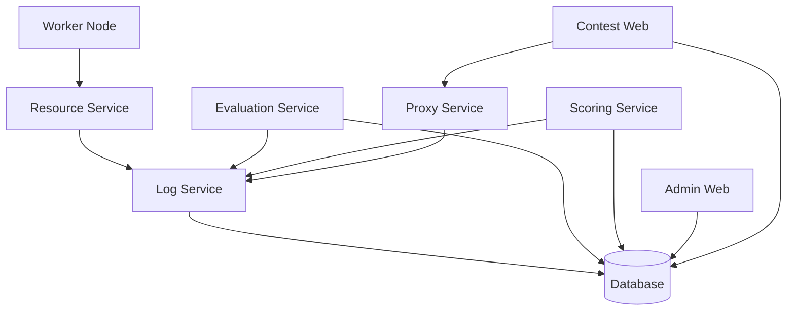

# CMS Service Architecture & Dependency Guide

This guide explains the relationships between CMS services and the correct order for restarting them to ensure system stability.

## Service Dependencies

CMS services are split into four main stacks: **Core**, **Admin**, **Contest**, and **Worker**.

### 1. Core Stack (The Foundation)
The Core stack must be healthy before any other services can function properly.

| Service | Depends On | Purpose |
| :--- | :--- | :--- |
| `database` | None | PostgreSQL database (Source of truth). |
| `log-service` | `database` (healthy) | Centralized logging for all other services. |
| `resource-service`| `log-service` | Monitors system resources. |
| `scoring-service` | `log-service`, `database` | Calculates scores and rankings. |
| `evaluation-service`| `log-service`, `database` | Manages the task evaluation queue. |
| `proxy-service` | `log-service` | Handles internal RPC communication. |
| `checker-service` | `log-service` | Validates submission results. |

### 2. Admin Stack
| Service | Depends On | Purpose |
| :--- | :--- | :--- |
| `admin-web-server` | `database` | Next.js Management Panel. |
| `ranking-web-server`| `database` | Real-time public rankings. |

### 3. Contest Stack
| Service | Depends On | Purpose |
| :--- | :--- | :--- |
| `contest-web-server`| `database`, `proxy-service` | The interface for contestants. |

### 4. Worker Stack
| Service | Depends On | Purpose |
| :--- | :--- | :--- |
| `worker` | `resource-service` | Executes user code in a sandbox. |

---

## Restart Strategy

Whenever you modify configuration files, follow this restart order to avoid "Restart Loops":

### Scenario A: Modified `.env.core` (DB Credentials/IPs)
1. Stop all services.
2. `make env` to regenerate the unified `.env`.
3. Start **Core Stack** first.
4. Once Core is healthy, start other stacks.

### Scenario B: Modified `config/cms.toml` (Worker Nodes/Logging)
1. Restart the **Core Stack** (specifically `log-service` and `resource-service`).
2. Restart **Workers** so they can reconnect to the updated resource service.

### Scenario C: Core Services in Restart Loop
If Core services are stuck restarting:
1. **Check Database Health**: `docker logs cms-database`. If it's not starting, credentials in `.env.core` might be wrong.
2. **Check Log Service**: `docker logs cms-log-service`. It often waits for the database.
3. **Verify Configuration**: Ensure `config/cms.toml` exists and is readable.
4. **Network Conflict**: Ensure `cms-network` is not being blocked by a pre-existing bridge with the same name.

## Dependency Mermaid Diagram

