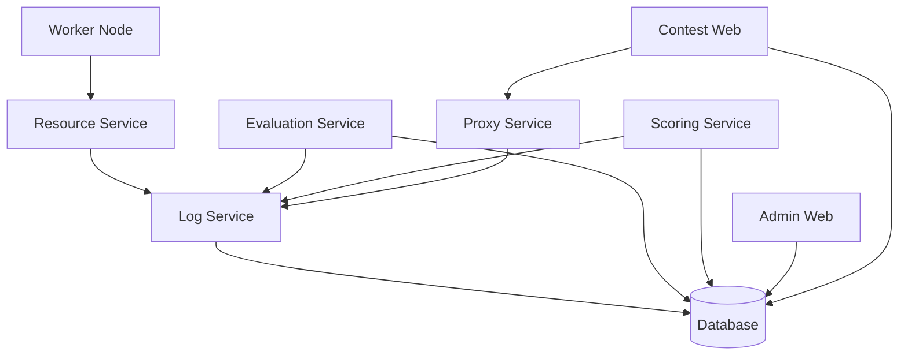

# CMS Service Architecture & Dependency Guide

This guide explains the relationships between CMS services and the correct order for restarting them to ensure system stability.

## Service Dependencies

CMS services are split into four main stacks: **Core**, **Admin**, **Contest**, and **Worker**.

### 1. Core Stack (The Foundation)
The Core stack must be healthy before any other services can function properly.

| Service | Depends On | Purpose |
| :--- | :--- | :--- |
| `database` | None | PostgreSQL database (Source of truth). |
| `log-service` | `database` (healthy) | Centralized logging for all other services. |
| `resource-service`| `log-service` | Monitors system resources. |
| `scoring-service` | `log-service`, `database` | Calculates scores and rankings. |
| `evaluation-service`| `log-service`, `database` | Manages the task evaluation queue. |
| `proxy-service` | `log-service` | Handles internal RPC communication. |
| `checker-service` | `log-service` | Validates submission results. |

### 2. Admin Stack
| Service | Depends On | Purpose |
| :--- | :--- | :--- |
| `admin-web-server` | `database` | Next.js Management Panel. |
| `ranking-web-server`| `database` | Real-time public rankings. |

### 3. Contest Stack
| Service | Depends On | Purpose |
| :--- | :--- | :--- |
| `contest-web-server`| `database`, `proxy-service` | The interface for contestants. |

### 4. Worker Stack
| Service | Depends On | Purpose |
| :--- | :--- | :--- |
| `worker` | `resource-service` | Executes user code in a sandbox. |

---

## Automated Restart Logic (Recommended)

The modern Admin Panel (port 8891) includes a **Dependency Analyzer** that automatically handles the restart strategy for you.

When you modify settings in the Admin Panel:
1.  **Change Detection**: The UI identifies which variables have changed.
2.  **Impact Analysis**: The system maps changed variables to specific services (e.g., changing `CONTEST_ID` identifies that `contest-web-server` needs a restart).
3.  **Dependency Expansion**: The system recursively adds services that depend on the impacted ones.
4.  **One-Click Apply**: You will be presented with a **"Save & Restart"** button that applies the configuration and executes the restarts in the correct sequence.

---

## Restart Strategy (Manual)
... (rest of the file)

## Dependency Mermaid Diagram

