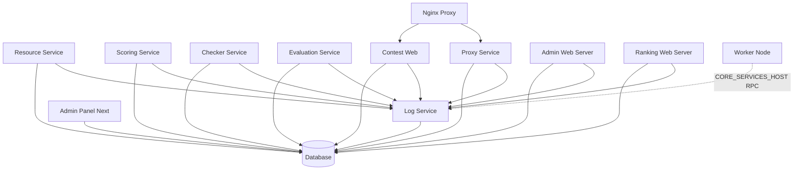

# CMS Service Architecture & Dependency Guide

This guide explains the relationships between CMS services and the correct order for restarting them to ensure system stability. For the stack/profile overview, see the [Architecture section of the README](../README.md#architecture).

## Service Dependencies

Dependencies below mirror the `depends_on` blocks in
[`docker-compose.yml`](../docker-compose.yml) — startup ordering is
healthcheck-gated, so `docker compose` brings services up in this order
automatically.

CMS services are split into five stacks: **Core**, **Admin**, **Contest**, **Worker**, and **Monitor**.

### 1. Core Stack (The Foundation)
The Core stack must be healthy before any other services can function properly.

| Service | Depends On | Purpose |
| :--- | :--- | :--- |
| `database` | None | PostgreSQL database (Source of truth). |
| `log-service` | `database` (healthy) | Centralized logging for all other services. |
| `resource-service`| `database`, `log-service` | Monitors system resources. |
| `scoring-service` | `database`, `log-service` | Calculates scores and rankings. |
| `checker-service` | `database`, `log-service` | Validates submission results. |

### 2. Admin Stack
| Service | Depends On | Purpose |
| :--- | :--- | :--- |
| `admin-panel-next` (:8891) | `database` | Modern Next.js Management Panel — manage everything here. |
| `admin-web-server` (:8889) | `database`, `log-service` | Legacy Python admin UI. |
| `ranking-web-server` (:8890) | `database`, `log-service` | Real-time public rankings. |
| `printing-service` (optional) | `database`, `log-service` | Contest printing service. |

### 3. Contest Stack
| Service | Depends On | Purpose |
| :--- | :--- | :--- |
| `contest-web-server` (:8888+) | `database`, `log-service` | The interface for contestants. |
| `evaluation-service` | `database`, `log-service` | Manages the task evaluation queue. |
| `proxy-service` | `database`, `log-service` | Handles internal RPC communication. |
| `nginx-proxy` | `contest-web-server`, `proxy-service` | Public front for the contest web (TLS option). |

### 4. Worker Stack
| Service | Depends On | Purpose |
| :--- | :--- | :--- |
| `worker` | None (compose) — targets core RPC via `CORE_SERVICES_HOST` | Executes user code in a sandbox. |

The worker has no compose `depends_on`: each worker host connects to the
main server's core services over the network (`CORE_SERVICES_HOST`, fixed
RPC ports 29000/28000/28500/22000/25000/28600 — see
[WORKER-SETUP.md](WORKER-SETUP.md)).

### 5. Monitor Stack
| Service | Depends On | Purpose |
| :--- | :--- | :--- |
| `monitor` | docker.sock (via `DOCKER_GID`) | Health/backups/Discord alerting. |

---

## Automated Restart Logic (Recommended)

The modern Admin Panel (port 8891) includes a **Dependency Analyzer** that automatically handles the restart strategy for you.

When you modify settings in the Admin Panel:
1.  **Change Detection**: The UI identifies which variables have changed.
2.  **Impact Analysis**: The system maps changed variables to specific services (e.g., changing `CONTEST_ID` identifies that `contest-web-server` needs a restart).
3.  **Dependency Expansion**: The system recursively adds services that depend on the impacted ones.
4.  **One-Click Apply**: You will be presented with a **"Save & Restart"** button that applies the configuration and executes the restarts in the correct sequence.

The mapping is driven by [`config/restart_policies.json`](../config/restart_policies.json).

---

## Dependency Mermaid Diagram

```mermaid
graph TD
    DB[(Database)]
    LOG[Log Service]
    RES[Resource Service]
    SC[Scoring Service]
    CHK[Checker Service]
    EV[Evaluation Service]
    PX[Proxy Service]
    CWS[Contest Web]
    NGINX[Nginx Proxy]
    PANEL[Admin Panel Next]
    ADMIN[Admin Web Server]
    RANK[Ranking Web Server]
    WORKER[Worker Node]

    LOG --> DB
    RES --> DB
    RES --> LOG
    SC --> DB
    SC --> LOG
    CHK --> DB
    CHK --> LOG

    EV --> DB
    EV --> LOG
    PX --> DB
    PX --> LOG
    CWS --> DB
    CWS --> LOG
    NGINX --> CWS
    NGINX --> PX

    PANEL --> DB
    ADMIN --> DB
    ADMIN --> LOG
    RANK --> DB
    RANK --> LOG

    WORKER -.->|CORE_SERVICES_HOST RPC| LOG
```
